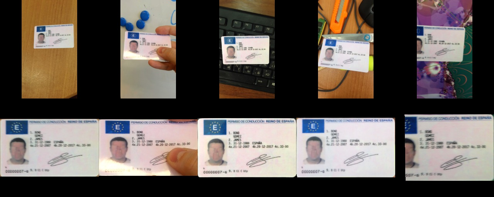
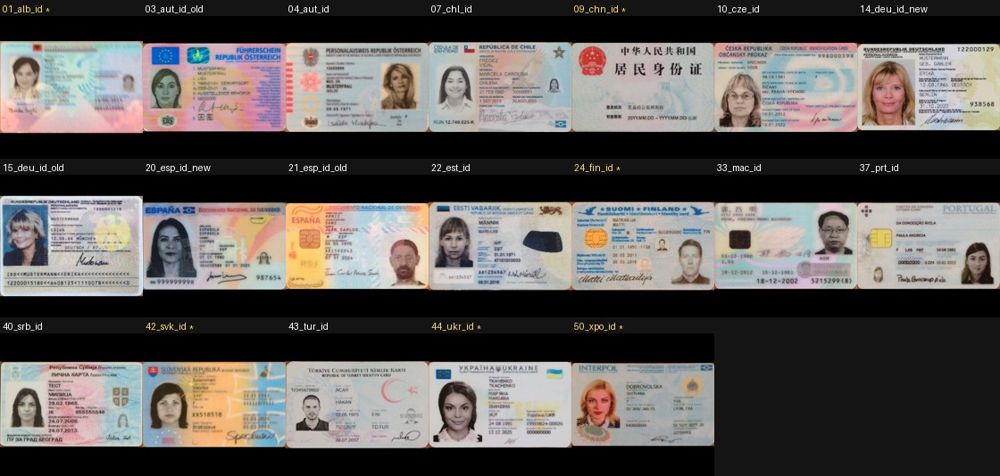
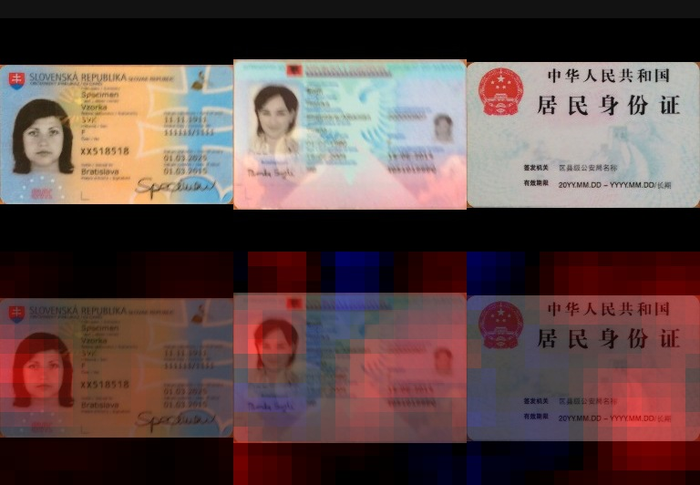
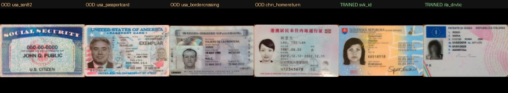

# Identity Document Classification — ResNet50 Transfer Learning

Classifies photographs of identity documents as **driving licence**, **passport**, or
**ID card**, using an ImageNet-pretrained ResNet50 as a frozen feature extractor with a
trained linear head, in PyTorch.



*Top: raw frames from MIDV-500 — the document on a table, in a hand, on a keyboard, against
clutter, half out of frame. Bottom: the same document perspective-rectified using its
ground-truth corner quadrangle. Same Spanish specimen throughout; the holder is fictional.*

Trained and evaluated on [MIDV-500](https://arxiv.org/abs/1807.05786) — 15,000 frames from
500 mobile-phone videos of 50 document types. Every document is a **public-domain specimen
with a fictional holder**, so no real personal data is involved. See
[DATASET.md](DATASET.md) for the data rationale.

---

## Results

Two honest numbers, because there are two different deployment questions.

| Regime | Question it answers | Accuracy |
|---|---|---|
| **Known design** | A user photographs a document type the model was trained on | **96.2% ± 1.0%** |
| **Unseen design** | A document design appears that nobody trained on | **70.8% ± 5.7%** |

Majority-class baseline ~43%. Both measured by this repository's own code
(`train.py --split-mode clip` and `crossval.py`).

Neither is "the" number. Quoting only the first overstates the system; quoting only the
second understates it. **The gap between them is the most useful thing this project has to
say** — and the rest of this README is about why that gap exists and how easy it is to
report the wrong one by accident.

**Which applies to you:** a KYC pipeline supporting a fixed list of countries enumerates its
document types and trains on all of them — that is the 96% regime, and it is strong. A
pipeline that must handle an unanticipated design is at 70% and should not ship without a
reject option.

```bash
pip install torch torchvision pillow numpy
python src/ingest.py                  # build the dataset (~75 min, ~420 MB)
python src/features.py --variant crop # cache ResNet50 embeddings (~11 min)
python src/crossval.py --folds 6      # the headline number (~1 min)
```

### A caveat on the 96%

MIDV-500 contains exactly **one physical specimen per document design**. The known-design
number therefore holds out whole *videos* of the same laminated card the model trained on.
That tests new capture conditions — angle, lighting, background — but not a different
person's licence of the same design.

Real deployment sees many individuals' documents of one design, varying in photo, name and
wear. This dataset cannot measure that, so **96.2% is an upper bound**, not an estimate. The
70.8% figure carries no equivalent weakness: designs held out under cross-validation are
genuinely unseen.

---

## Why one split was not enough

An earlier version of this README reported **82.6%** from a single train/test split. That
number was real — it is the accuracy on those particular 7 held-out designs — but it was
presented as a general estimate, which it was not. How that was caught is the most
transferable lesson here.

A single split's test set holds 700 frames, which sounds comfortable until you notice they
come from only **7 document designs**. The independent unit is the design, not the frame, so
the effective sample size is 7, not 700.

`src/stability.py` isolates where the variance actually lives:

| What varies | Spread in accuracy |
|---|---|
| Training seed (head init, batch order), split fixed | **± 0.003** |
| Which document designs are held out | **± 0.103**, range 0.571 – 0.853 |

Model training is essentially deterministic. **All the variance is in the split**, and it is
30× larger. The original 82.6% drew a favourable hand — a test set containing 1 weak design
out of 7 (14%), where the population rate is 13 of 46 (28%). Exactly half the expected
number of hard cases.

`src/crossval.py` does the appropriate thing: partition all 46 document types into six
stratified folds, hold each out in turn, report mean and spread.

```
fold 0: 0.7133    fold 3: 0.6414
fold 1: 0.8150    fold 4: 0.7357
fold 2: 0.6587    fold 5: 0.6843

CROSS-VALIDATED ACCURACY  0.7081 +/- 0.0572
```

**The lesson generalises past this project:** when your data has few independent units,
report an interval, not a point. A single split will hand you a number 12 points too high
and no indication that anything is wrong.

---

## The split rule is worth ~26 points of illusion

MIDV-500 has three levels of near-duplication — class → document type → video clip → frame.
How you split decides what your accuracy means.

| Split rule | Accuracy | What it actually measures |
|---|---|---|
| `random` (by frame) | 97.4% ± 0.4% | **Nothing.** Frames 11 and 12 of one 3-second video land on opposite sides of the split, so the test set is a copy of the training set. Invalid for any purpose. |
| `clip` (by video) | 96.2% ± 1.0% | **Known-design performance.** Legitimate — whole videos are held out — but an easier question, and an upper bound. |
| **`doctype`, cross-validated** | **70.8% ± 5.7%** | **Generalisation to designs never seen.** |

The distinction between rows two and three is the one that matters, and it is easy to miss:
both look like "held-out test data", and a reader skimming the code cannot tell them apart.
Row two answers a real question — it just is not the question you are answering if you claim
your model generalises.

Row one is not defensible for anything. It is what you get by calling `train_test_split` on
a dataframe of frames without asking where the frames came from.

```bash
python src/train.py --variant crop --split-mode random   # reproduce the illusion
```

---

## Generalising to unseen designs is genuinely hard

The cross-validated per-design scores show the real picture. This is bimodal, not a uniform
71%:

| Worst | | Best | |
|---|---|---|---|
| `29_irn_drvlic` | 0.00 | `27_hrv_passport` | 1.00 |
| `09_chn_id` | 0.01 | `20_esp_id_new` | 1.00 |
| `14_deu_id_new` | 0.01 | `06_bra_passport` | 1.00 |
| `26_hrv_drvlic` | 0.03 | `25_grc_passport` | 0.98 |
| `35_nor_drvlic` | 0.11 | `30_ita_drvlic` | 0.98 |

**13 of 46 document types score below 0.60 when held out.** Roughly two-thirds of designs
transfer; the rest fail outright. That is the honest characterisation — and it is invisible
under a single split, which reports one number and says nothing about which designs are
behind it.

Full per-design table: [`reports/crossval_crop.txt`](reports/crossval_crop.txt).

### One failure diagnosed causally



*All 19 ID-card types in MIDV-500 (\* = held out). Eighteen show a portrait photo.
`09_chn_id` is the emblem face — no portrait, no personal-data fields.*

`09_chn_id` scores 0.01. The model appears to have learned "ID card ⇒ contains a portrait",
true for 18 of 19 types, and falls through to the card-shaped alternative — driving licence.

`src/occlusion.py` tests that rather than asserting it, sliding a grey patch across
**correctly-classified** ID cards and measuring where `P(id_card)` drops:



*Top: input. Bottom: red = occluding here reduces `P(id_card)`.*

| Document | P(id_card) | under worst occlusion | pushed toward |
|---|---|---|---|
| Slovak ID | 0.560 | 0.357 | `driving_licence` |
| Albanian ID | 0.427 | 0.333 | `driving_licence` |

Masking the portrait **reproduces the Chinese ID failure on documents the model normally
gets right**. That is a causal claim, not a correlation with something visible in the image.

The failing designs stay in the evaluation. Dropping a test case because the model fails on
it inflates the headline by deleting the evidence.

---

## What document localisation is worth: not established

Each frame is rendered twice, so the value of a detection stage could be measured:

- **`crop`** — document perspective-rectified out of the frame using the ground-truth
  quadrangle. Stands in for a pipeline with a detector upstream.
- **`full`** — the whole camera frame; the document is often under 15% of the pixels.

| Variant | Cross-validated accuracy |
|---|---|
| `crop` | 0.708 ± 0.057 |
| `full` | 0.687 ± 0.053 |

A single split showed `crop` ahead by 9 points, which looked decisive. Across six folds the
gap is **+2.2 points with a paired SD of 6.8** (t = 0.78 on 5 df; 4 of 6 folds favour
`crop`). **Not significant.** The 9-point version was an artifact of one favourable split.

The honest conclusion is that this experiment lacks the power to resolve the question. Six
folds over 46 document types cannot separate effects smaller than roughly 10 points.
Reporting it as a 9-point win would have been wrong.

---

## Robustness across capture conditions

Pooled across all six folds, so every frame is scored exactly once while held out:

| Condition | Accuracy | n |
|---|---|---|
| clutter | 0.769 | 920 |
| keyboard | 0.730 | 920 |
| hand | 0.717 | 920 |
| table | 0.716 | 920 |
| **partial** | **0.615** | 920 |

Only `partial` — where the camera pans off the document — separates clearly. The other four
sit within about five points of each other, and frames within a clip are correlated, so that
ordering should not be read as meaningful. Notably a *single split* ranked `table` highest
and `clutter` second; under cross-validation the order reverses. That reordering is itself
evidence the differences are noise.

The encouraging read: background clutter and hand-held capture cost little.

---

## Pipeline

```
ingest.py -> features.py -> train.py -> predict.py
                         \-> crossval.py    (headline number)
                         \-> stability.py   (why CV is needed)
                         \-> occlusion.py   (failure diagnosis)
```

| Stage | What it does | Time |
|---|---|---|
| `ingest.py` | Streams 50 archives: download → perspective-rectify → 256px JPEG → delete. Peak disk ~1.5 GB instead of 33 GB. | ~75 min |
| `splits.py` | Partitions document *types* into train/val/test, stratified by class. | instant |
| `features.py` | Caches frozen ResNet50 2048-d embeddings once. | ~11 min |
| `train.py` | Trains the linear head; val-selected, test touched once. | seconds |
| `crossval.py` | Six-fold CV across document types. | ~1 min |
| `predict.py` | Classifies any document image. | instant |

### Why frozen features rather than full fine-tuning

Developed on a laptop with no CUDA GPU. Fine-tuning all 25M ResNet50 parameters would take
hours per epoch; embedding every image once and training a linear head takes **11 minutes
then seconds per run**.

That is not just a speed note — it is why the correction above happened. Cheap runs made the
stability analysis affordable. At an hour per run, this repository would have shipped 82.6%
and never caught it.

Trade-off, stated plainly: cached embeddings mean no augmentation during head training. The
resulting model is a 2048×3 linear layer — **26 KB**.

---

## Demo

```bash
python src/predict.py path/to/document.jpg
```

```
TA19_02.jpg
  -> driving_licence   0.554  ######################
     id_card           0.257  ##########
     passport          0.189  ########
```

---

## Saying "I don't know": a partial success

The classifier has three outputs and always picks one, which is what makes the 70.8%
regime unsafe. `src/reject.py` adds selective prediction — abstain when the maximum
softmax probability falls below a threshold τ, tuned **on the validation fold using only
the three trained classes**, then applied unchanged to the test fold and to the excluded
`other` documents. Those OOD frames never influence τ; tuning on them and then reporting
rejection rates against them would be circular.

### It does improve accuracy, at a price you may not want to pay

| τ | Coverage | Selective accuracy | OOD wrongly accepted |
|---|---|---|---|
| 0.00 | 100% | 71.0% | 100% |
| 0.50 | 72.9% | 76.8% | 60.7% |
| 0.60 | 52.9% | 82.0% | 42.3% |
| **0.70** | **37.8%** | **85.9%** | **25.0%** |
| 0.80 | 25.8% | 87.8% | 13.3% |

At the validation-tuned operating point (mean τ = 0.697) accuracy rises from 71.0% to
**80.5%** — but coverage falls to **38%**. You reject nearly two-thirds of legitimate
documents to gain nine points, and every rejection is a document a human now reviews.
Whether that trade is worth making is a product decision, not a modelling one, and the
table is here so it can be made explicitly.

Note also that the per-fold τ ranged from **0.435 to 0.835**, and the validation-tuned
threshold missed its 90% target (delivering 80.5%). The threshold is as unstable as
everything else here, for the same reason: too few independent document designs.

### Confidence barely detects novelty at all

| Scorer | Error detection | Novelty detection |
|---|---|---|
| Max softmax | **0.681** | 0.597 |
| Mahalanobis (Ledoit-Wolf shrunk) | 0.583 | **0.619** |

AUROC, where 0.5 is random. Max softmax ranks errors usefully but is near-useless for
novelty. Mahalanobis distance over the 2048-d embeddings — which ignores the three logits
and asks whether the feature vector is anywhere near the training distribution — recovers
only 0.022, well inside noise, and is worse at error detection.

**Two methods failing the same way is the finding.** No choice of τ fixes an AUROC of 0.6;
the score itself carries the problem, not the threshold.

### Why — the `other` class is not really out of distribution



Three of the four excluded documents are visually *the same kind of object* as the trained
ID-card class: portrait, card format, text fields. They are `other` because of a taxonomic
choice in [DATASET.md](DATASET.md), not a visual one.

Rejection rates by document, against the 61.7% of *legitimate* documents also rejected at
this threshold:

| Document | Rejected | vs. baseline |
|---|---|---|
| US border-crossing card | 93.0% | **+31.3** |
| China home-return permit | 91.3% | **+29.6** |
| US Social Security card | 72.8% | +11.1 |
| **US passport card** | **42.5%** | **−19.2** |

So the score is not random — it flags genuinely unfamiliar layouts strongly. But the US
passport card is accepted *more readily than real driving licences are*, because it is an
identity card in every visual respect. Asking a vision model to reject it as "unknown"
means asking it to reproduce a taxonomic decision that is not present in the pixels.

Full output: [`reports/reject.txt`](reports/reject.txt).

The honest conclusion: **a post-hoc confidence score is the wrong tool for this.** The fix
is an explicit reject class trained on negatives, or fine-tuning that shapes the feature
space for the distinction — not a threshold on a head that was never given anywhere to put
an unfamiliar document.

## Known limitations

- **Abstention helps but costs too much coverage.** Reaching 80.5% accuracy means
  answering only 38% of documents. See the section above.
- **Novelty detection essentially does not work** (AUROC 0.60 for both scorers tried).
- **A third of designs do not transfer.** 13 of 46 score below 0.60 when unseen.
- **One document face per type.** MIDV-500 captures a single side, so the model never sees
  the reverse of an ID card — precisely what breaks `09_chn_id`.
- **One specimen per design**, so known-design accuracy is an upper bound.
- **Underpowered ablations.** 46 document types in 6 folds cannot resolve differences below
  roughly 10 points.
- **No augmentation** during head training, a consequence of caching embeddings.

## Next steps

1. An explicit fourth `unknown` class trained on negatives, since the post-hoc
   confidence scores tried here do not separate near-distribution documents.
2. Fine-tune `layer4` with augmentation and compare against the linear probe.
3. Evaluate on MIDV-2019 — the same documents under low light and extreme projective
   distortion — as a robustness test.

## Licence and attribution

MIDV-500 is distributed under **CC BY-SA 2.5**. The specimen images reproduced in
`reports/` derive from it. If you publish results or images from this dataset, cite:

> Arlazarov, V.V., Bulatov, K., Chernov, T., Arlazarov, V.L. *MIDV-500: A Dataset for
> Identity Document Analysis and Recognition on Mobile Devices in Video Stream.*
> Computer Optics 43(5), 2019.
